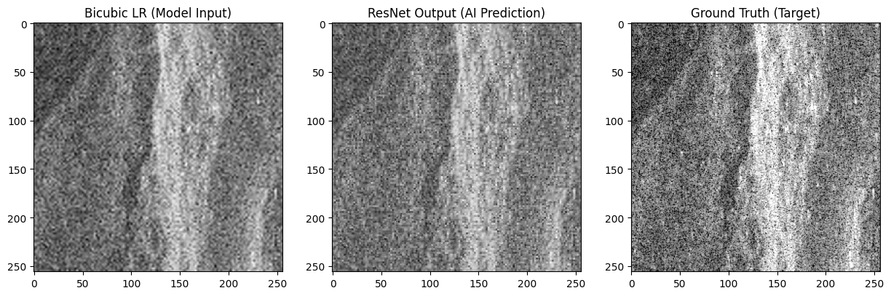
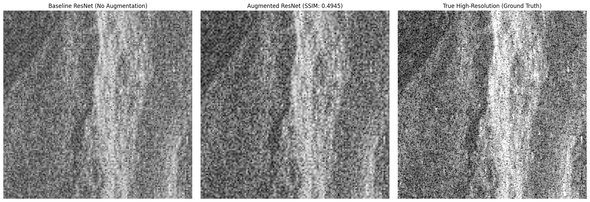
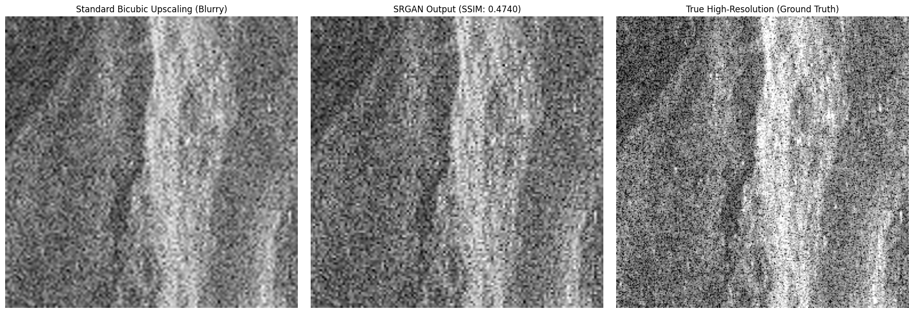

# 🛰️ Synthetic Aperture Radar (SAR) Super-Resolution using GANs

An advanced Deep Learning pipeline designed to enhance low-resolution Synthetic Aperture Radar (SAR) imagery using a custom Super-Resolution Generative Adversarial Network (SRGAN). 

**Author:** Gabriel Danho  
**Course:** Deep Learning  
**Instructor:** Professor Amit Kumar Mishra  

---

## 📖 Project Overview
SAR images are critical for Earth Observation because they can capture high-resolution data through dense cloud cover and at night. However, high-resolution SAR data is computationally expensive and difficult to acquire. 

This project tackles the challenge of algorithmically upscaling low-resolution SAR imagery. By navigating the strict physical laws of radar backscatter (speckle interference and directional shadowing), this pipeline transitions from standard Convolutional Neural Networks (ResNet) to a fully optimized, physics-aware SRGAN.

## 🚀 Key Features & Methodology

* **Cloud-Native Data Engineering:** Automated ingestion of raw Single Look Complex (SLC) and Geocoded (GEO) radar data using the **STAC API** (SpatioTemporal Asset Catalog), safely extracting hundreds of 256x256 training patches without overwhelming system RAM.
* **Custom Combined Loss Functions:** Addressed the blurring effect of standard Mean Squared Error (MSE) by engineering a custom loss function blending **Structural Similarity (84% SSIM)** and **Mean Absolute Error (16% L1)** to preserve sharp urban structures.

*Figure 1: Initial success using ResNet with Combined Loss (Cell 4.4) - achieving high-resolution reconstruction from bicubic downsampled inputs.*

* **The Physics of Data Augmentation:** Conducted A/B testing which scientifically proved that standard geometric augmentations (flips/rotations) destroy the directional integrity of SAR shadows and speckle, causing model degradation.

*Figure 2: The "Physics Trap" (Cell 4.6) - Visualizing how arbitrary rotations and flips confuse the model by defying radar shadow geometry.*

* **Adversarial Training (SRGAN):** Implemented a custom training loop using `tf.GradientTape` with advanced stabilization techniques:
  * **TTUR (Two Time-Scale Update Rule):** Decelerated Discriminator learning to prevent vanishing gradients.
  * **Label Smoothing:** Prevented Discriminator overconfidence.
  * **Exponential Decay Schedulers:** Dynamically cooled learning rates to allow microscopic texture fine-tuning in late-stage training.

## 📊 Results & The Perception-Distortion Tradeoff

Standard visual metrics (PSNR and SSIM) are mathematically biased towards "safe," blurry images. During testing on completely unseen full-scale SAR data, we observed the classic **Perception-Distortion Tradeoff**:

*Figure 3: The Grand Finale (Cell 4.9) - Comparing SRGAN Output against Ground Truth. Note the sharp, realistic radar texture despite lower mathematical scores.*

| Model Architecture | Validation SSIM | Validation PSNR | Visual Quality |
| :--- | :--- | :--- | :--- |
| **1. Baseline ResNet** | 0.5505 | 16.35 dB | Smooth / Blurry |
| **2. SRGAN (No Scheduler)** | 0.4740 | 16.08 dB | Unstable Textures |
| **3. SRGAN + Scheduler (Final)**| 0.4698 | 15.97 dB | **Highly Detailed / Realistic** |

**Conclusion:** While the Baseline ResNet scored the "highest" mathematically by blurring out difficult radar speckle, the final Scheduled SRGAN is the vastly superior model. By taking mathematical risks to generate high-frequency, physically accurate radar textures and sharp building edges, the SRGAN produces a highly realistic image tailored for human radar analysis.

## 🛠️ Tech Stack
* **Deep Learning:** TensorFlow 2.x, Keras (Custom Training Loops, GradientTape)
* **Geospatial Processing:** Rasterio, OpenCV
* **Data Pipelines:** PySTAC, stac-asset, Pandas, NumPy
* **Environment:** Google Colab (GPU Accelerated)

## 💻 How to Run

1. Open the project notebook in **Google Colab**.
2. Ensure GPU acceleration is enabled (`Runtime` -> `Change runtime type` -> select `T4 GPU`).
3. Follow the sequential cells to reproduce the training and evaluation results.

## 🗄️ Data Source
This project utilizes the [Capella Space Open Data Catalog](https://capella-open-data.s3.us-west-2.amazonaws.com/stac/capella-open-data-ieee-data-contest/collection.json) specifically the IEEE Data Contest (GEO SAR Imagery) collection.
